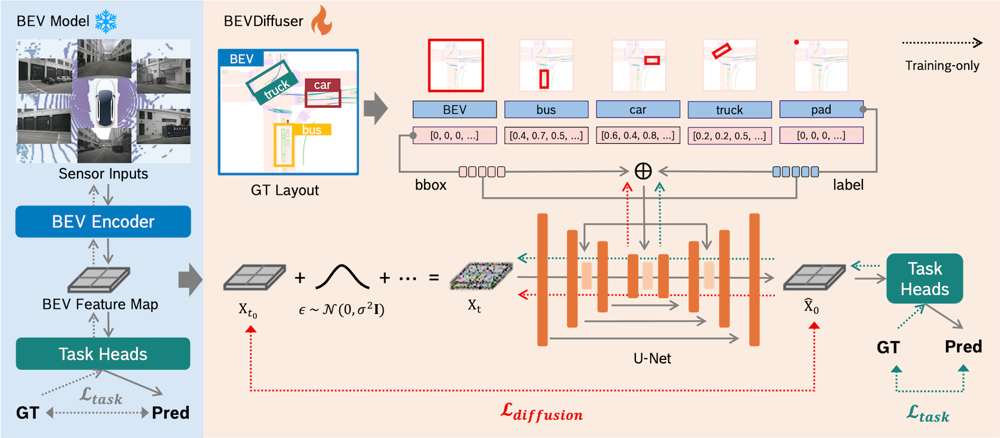

<div align="center">
<h2> BEVDiffuser: Plug-and-Play Diffusion Model for BEV Denoising</br>with Ground-Truth Guidance</h2> 

**CVPR 2025 Highlight**

<a href="https://arxiv.org/pdf/2502.19694"></a>
<a href='https://xin-ye-1.github.io/BEVDiffuser/'></a>


<br>
</div>


Official implementation of BEVDiffuser. 

## 用 Docker 一键复现环境（推荐）

这套 BEVFormer/mmdet3d 栈对 PyTorch / CUDA / mmcv 版本极其敏感，手动安装很容易踩版本坑。
我们提供了锁死所有版本的 [`Dockerfile`](Dockerfile)，任何人拿到仓库后只需构建一次镜像即可无缝复现训练与推理。

镜像只包含"运行环境"；工程代码、nuScenes 数据集、模型权重在运行时挂载进容器（数据太大不打进镜像）。

### 0. 大白话理解 Docker
- **镜像 (image)**：一份装好所有软件的系统快照（像一份"菜谱"或一张光盘）。
- **容器 (container)**：用镜像跑起来的隔离小环境（像按菜谱做出来的那道菜）。
- **Dockerfile**：写给 Docker 的"安装步骤说明书"，`docker build` 按它自动装出镜像。

### 1. 宿主机准备 NVIDIA 容器运行时（仅首次，需 root）
让 Docker 能用上 GPU（Ubuntu）：
```bash
distribution=$(. /etc/os-release; echo $ID$VERSION_ID)
curl -s -L https://nvidia.github.io/libnvidia-container/gpgkey | \
  sudo gpg --dearmor -o /usr/share/keyrings/nvidia-container-toolkit-keyring.gpg
curl -s -L https://nvidia.github.io/libnvidia-container/$distribution/libnvidia-container.list | \
  sed 's#deb https://#deb [signed-by=/usr/share/keyrings/nvidia-container-toolkit-keyring.gpg] https://#g' | \
  sudo tee /etc/apt/sources.list.d/nvidia-container-toolkit.list
sudo apt-get update && sudo apt-get install -y nvidia-container-toolkit
sudo nvidia-ctk runtime configure --runtime=docker && sudo systemctl restart docker
# 验证：能打印 nvidia-smi 即成功
docker run --rm --gpus all nvidia/cuda:11.1.1-base-ubuntu20.04 nvidia-smi
```

### 2. 构建镜像（在仓库根目录，首次较慢：下载数 GB + 编译 mmdet3d）
```bash
docker build -t admm-diff:cu111 .
```

### 3. 启动容器（代码 / 数据 / 权重运行时挂载）
```bash
docker run --gpus all -it --shm-size=16g \
  -v $(pwd):/workspace/ADMM-Diff \
  -v /path/to/nuscenes:/data/nuscenes \
  -v /path/to/ckpts:/data/ckpts \
  admm-diff:cu111
```
- `-v $(pwd):/workspace/ADMM-Diff`：把当前仓库挂进容器，改代码无需重建镜像。
- `--shm-size=16g`：DataLoader 多进程需要较大共享内存，否则容易报错。
- `/path/to/nuscenes`、`/path/to/ckpts` 换成你宿主机上数据集与权重的真实路径。

### 4. 进容器后设置路径并运行
进入容器后，把 [`env.sh`](env.sh) 里的路径指向容器内挂载点（`/data/...`），再按 [Run and Eval](BEVFormer/docs/getting_started.md) 跑训练 / 测试：
```bash
cd /workspace/ADMM-Diff
# env.sh 内改为：
#   export NUSCENES_DATAROOT=/data/nuscenes/
#   export NUSCENES_INFO_ROOT=/data/nuscenes/pkl_4_bevdiffuser/
#   export BEV_CKPT=/data/ckpts/bevformer/bevformer_tiny_epoch_24.pth
source env.sh
# 自检：环境是否就绪
python -c "import torch, mmcv, mmdet, mmdet3d, detectron2; print('env ok, cuda:', torch.cuda.is_available())"
```


## 直接拉取docker环境镜像，下载后直接挂载工程代码、数据集、ckpt、调度器模型即可使用！

### 0. 访问：
https://pan.baidu.com/s/1UAOHHXDom9dz6Kqd-l7Grg?pwd=IFNT 提取码: IFNT 
即可下载docker环境镜像。 要求你的系统中安装有docker！！

### 1. 加载docker环境：
```bash
docker load -i wz-bevdiffuser-main-cu111.tar.gz
```

### 2.使用方式：
```bash
docker run --rm -it \
  --name wz-bevdiffuser-debug \        #这里名字随便取，注意docker不允许同名实例。
  --gpus all \  #暴露所有gpu给docker环境使用
  --ipc=host \ #是一条是指docker和宿主公用dev/shm/
  --shm-size=16g \ #给容器的dev/shm/分配16g空间，和上一条同时出现时，上一条优先。
  -v /data/panpingping/wangzi/BEVDiffuser-main:/workspace/BEVDiffuser-main \   #此处是挂载逻辑：代码，数据集，ckpt和调度器。：左边是宿主机docker可以识别到的路径；右边是对应的docker容器内的路径。用户只需要改：左侧自己的路径，右侧不需要改。
  -v /data/panpingping/wangzi/ckpts:/mnt/wangzi/ckpts \
  -v /data/panpingping/wangzi/nuscenes:/mnt/wangzi/nuscenes \
  -v /data/panpingping/wangzi/huggingface_cache:/root/.cache/huggingface \
  wz-bevdiffuser-main:cu111

```

### 3.跑模型：
```bash
cd /workspace/BEVDiffuser-main/BEVFormer/projects/bevdiffuser
bash test.sh
```


## BEVDiffuser with BEVFormer
- [Installation（手动安装，进阶/备选）](BEVFormer/docs/install.md)
- [Prepare Dataset](BEVFormer/docs/prepare_dataset.md)
- [Run and Eval](BEVFormer/docs/getting_started.md)

## Acknowledgement
Large parts of the code base are inspied and build on top of the following projects:
- [BEVFormer](https://github.com/fundamentalvision/BEVFormer)
- [LayoutDiffusion](https://github.com/ZGCTroy/LayoutDiffusion)
- [diffusers](https://github.com/huggingface/diffusers)

## Citation

If find this work helpful, please consider citing: (bibtex)

```
@InProceedings{ye2025bevdiffuser,
    author={Ye, Xin and Yaman, Burhaneddin and Cheng, Sheng and Tao, Feng and Mallik, Abhirup and Ren, Liu},
    title={BEVDiffuser: Plug-and-Play Diffusion Model for BEV Denoising with Ground-Truth Guidance},
    booktitle = {Proceedings of the IEEE/CVF Conference on Computer Vision and Pattern Recognition},
    month = {June},
    year = {2025}
}
```
